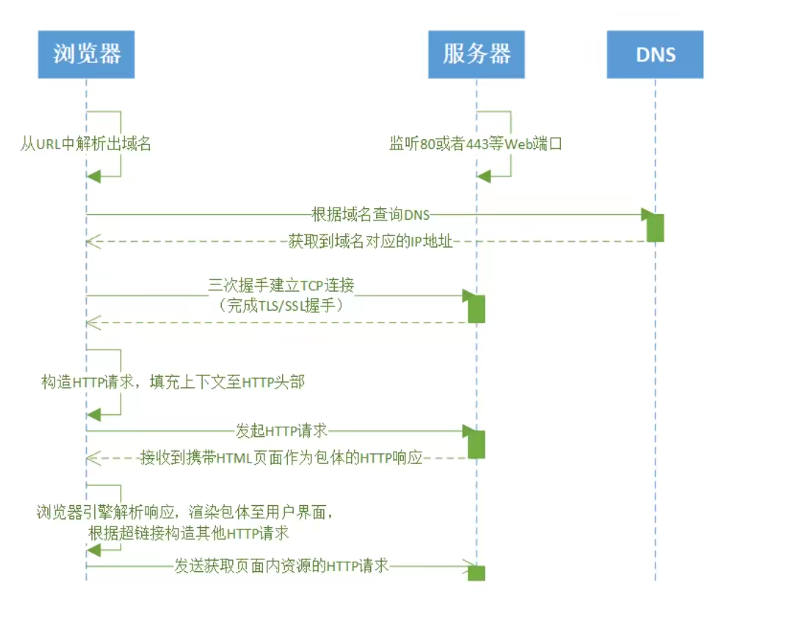
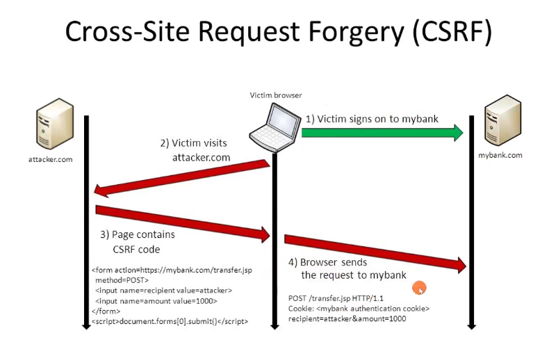

## HTTP

### 1. 浏览器请求服务器的过程

### 2. HTTP定义

① 应用层的无状态的：连续的两个请求中，后一个请求不能依赖前一个请求；

② 以请求/应答方式运行的协议，一定是基于一个有客户端发起的连接请求；

③ 可扩展的语义，浏览器http版本和服务器版本相互兼容；

④ 自描述消息格式，可以标识资源类型；

### 3. cookie

cookie是一种http状态管理机制，保存在客户端，由浏览器维护

set-cookie中描述cookie-pair属性：

- Expires

  指定cookie过期时间

- Max-Age

  多少秒之后过期，不能是0，优先级高于expire

- Domain

  cookie可用的域名，默认可以访问当前域名

- Path

  指定path下可用这个cookie，path=/ 表示根路径下所有路径都可以使用

- Secure

  设置了这个属性，表示只有使用TLS/SSL协议（https）时才能使用cookie

- HttpOnly

  不能使用js（document.cookie、XMLHttpRequest、Request APIs）访问cookie

使用限制：

cookie会增加传输流量，由于在http中是明文传递的，所以有安全性问题，且大小不应该超过4KB

#### cookie和session常见用法

当我们登陆一个网页系统，输入用户名和密码之后，服务器接收到请求后，根据用户名和密码去匹配数据库的用户信息，如果成功，则生成一个sessionId，记录用户的信息和登陆状态，并将set-Cookie：sessionId = xxx 写入响应头，返回给客户端，当客户端收到了这个set-cookie的属性，浏览器就会在下次请求时，带伤cookie，那么服务器根据请求的cookie可以从数据库中获取资源，获取用户的登录状态和信息。

#### 第三方cookie可以追踪用户的信息：

当我们在A站点访问各种资源，也有来自B站点的图片，如果请求B站点资源会返回set-cookie，浏览器则会记录下cookie，那么下次直接在B站点访问图片，就会带上原先的cookie，那么B站点就会知道这个用户的身份，知道曾经访问过什么资源。

但是我们不想要用户信息的泄露，浏览器要防止不同站点间读取用户信息，便有了跨域和同源策略。

### 4. 同源策略

#### 为什么需要同源策略？

- 当用户主动访问一个网页时，可能会访问很多资源，但是用户并不是主动访问这些资源的。如果没有同源策略就不能保证是用户自愿发出的，只能保证请求时来自同一个浏览器。

- 不同站点间的数据可能会被篡改

#### 什么是同源策略

限制了从同一个源加载的文档或脚本如何与来自另一个源的资源进行交互。

同源：协议、主机、端口号必完全相同。

CSRF跨站攻击：

当浏览器去访问一个mybank.com网站，知识后浏览器会记录cookie信息，如果之后去访问一个不明的网站，attacker.com，如果用户误点了某个按钮，访问了mybank.com，浏览器会自动加上cookie的信息，那么attacker.com就可以获取用户在A站点的信息，造成安全问题.

